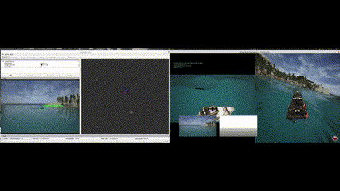

# Pure Vision Is All You Need

## Usage
1. Create the workspace and clone the perception package
    ``` bash
    mkdir easy_ws
    cd easy_ws
    mkdir src
    cd src
    git clone https://github.com/EasyLaboratory/perception.git
    cd perception
    ```
2. Set up the virtual environment
    ```bash
    sudo apt install python3-venv
    python3 -m venv yolo_venv
    source yolo_venv/bin/activate
    pip install -r requirements.txt -i https://mirrors.tuna.tsinghua.edu.cn/pypi/web/simple some-package
    ```
3. Start the airsim ros node, referring to [airsim official page](https://microsoft.github.io/AirSim/airsim_ros_pkgs/]).  

4. Copy the settings file

5. Launch the perception node.If you use remote connection(WSL works the same), set the remote_ip to the ip of your remote airsim simulator. And the remote_ip default value is 127.0.0.1 which will work when the airsim simulator works in the same machine.
    ```bash
    roslaunch perception perception.launch remote_ip:=192.168.1.12
    ``` 
## Fly With Gimbal
1. Set the UDP buffer. 
```bash
sudo sysctl -w net.core.rmem_max=8388608
sudo sysctl -w net.core.rmem_default=8388608
```
2. Start the simulator.
```bash
cd LinuxNoEditor
bash Blocks.sh
```
3. Turn on the sensor.
```bash
cd easyTrack
catkin_make
source ./devel/setup.bash
roslaunch perception sensor.launch
```
4. Take off the drone in another terminal.
```bash
cd easyTrack
source ./devel/setup.bash
roslaunch se3controller flying_example.launch 
```
5. Analyse the error.
```bash
rqt_plot /position_error/x  /position_error/y /position_error/z
```

## Tips
1. Use the settings in etc directory.
2. **Set the intrinsic parameter properly when the camera setting changes.** The intrinsic  value is set in K as shown below.
    ```python
    K=[320.0, 0.0, 320.0, 0.0, 320.0, 240.0, 0.0, 0.0, 1.0]
    ``` 
    You can look at the K in airsim topic and copy the K value to the source code.
3. Get the specific camera topic
    ```bash
    rostopic list
    rostopic echo /some/camera/info
    ```
## Dependency
1. airsim simulator
2. Intel RealsenseD457

## Road Map
1. Improve the model accuracy to adapt the changing road conditions.
2. Process the noise of the deep camera.
3. Process the target loss condition.
4. Deploy the model to a more general condition, such as use quantitative pruning and distillation to accelerate the inference process.
5. Rewrite this piece of code to c++. 


